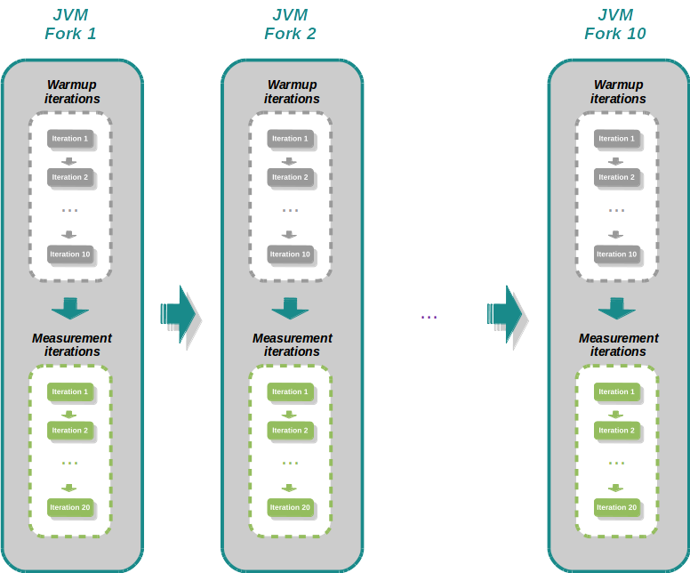

# jmh-demo

JMH is short for Java Microbenchmark Harness. It is a toolkit developed by the same people who implement the JVM that helps you implement Java microbenchmarks correctly. 


Why do I need to learn a difficult framework when I can do the benchmark as I always have done by calculating timestamps? :confused: E.g:

```
public class CustomBenchmark {

    public static void main(String[] args) {

        testSqrt();
        testJavaSqrt();
        testConstant();
    }

    public static void benchamark(int times, Runnable runnable) {
        long start = System.nanoTime();
        String methodName = Thread.currentThread().getStackTrace()[2].getMethodName();
        for (int i = 0; i < times; i++) {
            runnable.run();
        }
        double end = (System.nanoTime() - start) / 1_000_000d;
        System.out.printf("%s ran %f ops/ms/n", methodName, times / end);
    }
    
    private static double sqrt(double num) {
        return Math.exp(0.5 * Math.log(num));
    }

    private static double javaSqrt(double num) {
        return Math.sqrt(num);
    }
    
    private static void testSqrt() {
        benchamark(1_000_000, () -> sqrt(10));
        System.out.println();
    }

    private static void testJavaSqrt() {
        benchamark(1_000_000, () -> javaSqrt(10));
        System.out.println();
    }
    
    private static double constant() {
        return 10d;
    }
    
    private static void testConstant() {
        benchamark(1_000_000, () -> constant());
        System.out.println();
    }
}    
    
```

We might be tempted to use a solution similar to the above for benchmarking. The problem with the solution above is that we are not considering the JVM optimization. The JVM optimization will cause the benchmark to produce misleading results. If we run the benchmarks above we will obtain the results below:

```
testSqrt ran        54898.942849 ops/ms/n
testJavaSqrt ran   113059.298698 ops/ms/n
testConstant ran    43916.783317 ops/ms/n
```

From the result, we can see that `testSqrt` and `testJavaSqrt` are more efficient than `testContant` which doesn't contain any calculations. The reason for this strange result is the dead code elimination optimization that JVM does for `testSqrt` and `testJavaSqrt`. Dead Code Elimination is an optimization that removes code that does not affect the program results. To fix this issue we will need to make changes to the methods testSqrt and testJavaSqrt to prevent dead code elimination optimization from happening and causing misleading results.


```
    private static double testSqrt() {
        double[] placeholder = new double[1];
        benchamark(1_000_000, () -> placeholder[0] = sqrt(10));
        System.out.println();
        return placeholder[0];
    }

    private static double testJavaSqrt() {
        double[] placeholder = new double[1];
        benchamark(1_000_000, () -> placeholder[0] = javaSqrt(10));
        System.out.println();
        return placeholder[0];
    }
```

After applying the changes above  we will obtain the following results:

```
testSqrt ran          57955.280894 ops/ms/n
testJavaSqrt ran      96716.578547 ops/ms/n
testConstant ran      82457.096130 ops/ms/n
```

We saw after the modification of the methods the performance dropped to more realistic results. Still, we haven't prevented all JVM optimization. JVM performs constant folding on `testSqrt` and `testJavaSqrt`  methods that prevent the benchmark to produce correct results. Constant folding is an optimization technique that eliminates expressions that calculate a value that can already be determined before code execution. 

```
    static double num = 10;

    private static double testSqrt(double num) {
        double[] placeholder = new double[1];
        benchamark(1_000_000, () -> placeholder[0] = sqrt(num));
        System.out.println();
        return placeholder[0];
    }

    private static double testJavaSqrt(double num) {
        double[] placeholder = new double[1];
        benchamark(1_000_000, () -> placeholder[0] = javaSqrt(num));
        System.out.println();
        return placeholder[0];
    }
```

After applying the changes above we will get the following benchmark results:

```
testSqrt ran         22790.110241 ops/ms/n
testJavaSqrt ran     40325.639920 ops/ms/n
testConstant ran     49956.275770 ops/ms/n
```

JMH makes it much easier to write and run benchmarks by providing a very solid foundation for writing and running benchmarks whose results are not erroneous due to unwanted virtual machine optimizations.


### JMH Architecture Overview


- **Fork** is also called a trial. In the above example output, you can see it is performed two trials. A trial contains a set of warmups and iterations.
- **Warmup**: JMH does runs of a given benchmark but it discards the results. It's role is to allow the JVM to perform any class loading, compilation to native code, and caching steps it would normally do in a long-running application before starting to collect actual results and perform analysis.
- **Iterations**: Execute benchmark after the warmup iterations. JMH uses only the result from running benchmark in the iterations phase to perform perfomance analysis.
- **Invocation**: is a sngle run of benchmark.
- **Setup** marks the fixture method to be run before the benchmark.
- **TearDown** marks the fixture method to be run after the benchmark..


### Getting Started

If we want to kickstart a new JMH project for testing different pieces of our software we can use the Maven archetype for JMH like the below:

```
mvn archetype:generate
          -DinteractiveMode=false
          -DarchetypeGroupId=org.openjdk.jmh
          -DarchetypeArtifactId=jmh-java-benchmark-archetype
          -DgroupId=com.jenko     
          -DartifactId=first-benchmark
          -Dversion=1.0
```

In order to include JMH in the existing project, we need to provide the following dependencies in the project pom file:

```
<dependency>
    <groupId>org.openjdk.jmh</groupId>
    <artifactId>jmh-core</artifactId>
    <version>X.X.X</version>
</dependency>
<dependency>
    <groupId>org.openjdk.jmh</groupId>
    <artifactId>jmh-generator-annprocess</artifactId>
    <version>
```

After adding the dependencies, we add the main class that starts the benchmarking process:

```
public class BenchmarkRunner {
    public static void main(String[] args) throws IOException, RunnerException {
        org.openjdk.jmh.Main.main(args);
    }
}
```

To create a benchmark we need to add the annotation `@Benchmark` to the method that will measure the code performance, like below:

```
    @Benchmark
    public void testCalculateFibonacci(){
        Fibonacci.calculate(10);
    }
```


### JMH - Types of Benchmark

We have different types of benchmarks that measure various aspects of code performance:

- **Throughput** - measures the number of operations per second
- **Average Time** - measures the average time it takes for the benchmark method to execute (a single execution).
- **Sample Time** - Measures how long time it takes for the benchmark method to execute, including max, min time etc.
- **Single Shot Time** - measures how long time a single benchmark method execution takes to run. This is good to test how it performs under a cold start (no JVM warm up).
- **All** -  measures all of the above.

These can be configured via @BenchmarkMode annotation, e.g. :

```
    @BenchmarkMode(Mode.AverageTime)
    @Benchmark
    public void testCalculateFibonacci(){
        Fibonacci.calculate(10);
    }
```

### JMH - Time Units

JMH supports various time units: 

 - NANOSECONDS 
 - MICROSECONDS  
 - MILLISECONDS  
 - SECONDS  
 - MINUTES  
 - HOURS  
 - DAYS
 
 These can be configured via  @OutputTimeUnit annotation, e.g. :
 
 ```
    @OutputTimeUnit(TimeUnit.NANOSECONDS)
    @Benchmark
    public void testCalculateFibonacci(){
        Fibonacci.calculate(10);
    }
 ```
 
 ### Configuring Warmup and Execution
 
The ```@Fork``` annotation, instructs how many benchmark trials (forks) will happen. The value parameter controls how many times the trials are going to run for the benchmark, and the warmup parameter controls how many times a benchmark will run before results are collected. The executions result from the warmup are discarded. After the warmup executions are finished then we proceed with trial executions. E.g. :
   
  ```
@Benchmark
@Fork(value = 5, warmups = 3)
public void testCalculateFibonacci(){
    Fibonacci.calculate(10);
}
  ```
  
The example above instructs JMH to run 5 forks(trials) sequentially. The first three iterations will be warmup and results will be discarded.

The ```@Warmup``` annotation determines the number of warmup executions inside a fork(trial).

```
@Benchmark
@Warmup(iterations = 5)
public void testCalculateFibonacci(){
    Fibonacci.calculate(10);
}
```

The example above instructs JMH to run 5 warmup executions before starting measurement execution for each fork(trial).

The `@Measurement``` annotation determines the number of measurement execution inside a fork(trial).

```
@Benchmark
@Measurement(iterations = 5)
public void testCalculateFibonacci(){
    Fibonacci.calculate(10);
}
```

The example above instructs JMH to run 5 measurement execution inside a fork(trial).



### State 

In some cases, you need to initialize variables that your benchmark will need but you don't want the initializing process to be part of the code that the benchmark measures. JMH offers a solution to this problem called state variables. State variables are declared in special state classes, and an instance of that state class can then be provided as a parameter to the benchmark method. The state class needs to be annotated with the @State annotation. Also, the state object should follow the below standards:

- The class must be declared public
- If the class is nested, then it should be a static class
- The class must have a public no-parameter constructor

E.g:

```
    @State(Scope.Benchmark)
    public static class FibonacciState {
        @Param({"5", "6"})
        public int value;
    }

    @Benchmark
    public void testCalculateFibonaccix(FibonacciState state){
        Fibonacci.calculate(state.value);
    }
```

The scope of the state object defines to which	extent it is shared	among the worker threads. States can be injected into benchmark methods as arguments, and also on ```@Setup``` and ```@TearDown```	methods. JMH provides different scopes that the state object can be reused. These are:

- **Thread**: each thread running the benchmark will create its own instance of the state object
- **Group**: each thread group running the benchmark will create its own instance of the state object
- **Benchmark**: all threads running the benchmark share the same state object


We use the `@Setup` annotation on the method that will initialize with the state object before it's passed down to the benchmark. Also, we use the `@Teardown` annotation on the method that will clean the state object. The setup and tear-down execution time are not included in the benchmark runtime measurements. E.g. :

```
@BenchmarkMode(Mode.AverageTime)
@OutputTimeUnit(TimeUnit.NANOSECONDS)
@Fork(value = 1, jvmArgs = {"-Xms2G", "-Xmx2G"})
public class SearchBenchmark {

    @State(Scope.Benchmark)
    public static class SearchState {
        @Param({"1", "10", "100"})
        public int parameter;
        public List<Integer> list;

        @Setup(Level.Trial)
        public void setup() {
            list = IntStream.range(1, 100).boxed().collect(Collectors.toList());
        }

        @TearDown
        public void tearDown(){
            list = null;
        }
    }

    @Benchmark
    public void streamSearchBenchamrk(SearchState searchState){
        searchState.list.stream().anyMatch( i -> i==searchState.parameter);
    }
}
```

Both `@Setup` and `@Teardown` annotations have a parameter that instructs JMH when to call the methods. The possible values that can be passed are:

- Level.Trial - is called for each full run of the fork(including warmup and measurement iterations)
- Level.Iteration - is called for each iteration of the benchmark
- Level.Invocation - is called for each call of the benchmark method


 
 ### JVM optimization 
 
 
 #### Dead Code Elimination
 
We faced the same issue in our example in the beginning when we weren't using the JMH framework to benchmark code. We solved the issue by returning the object. This way we tricked the compiler to think that the code is being used by some other component.

JMH offers us another option to prevent dead code elimination optimization. It provides us with a `BlackHole` object that we can use to consume objects instead of returning them as we did before. Below is an example of using a black hole object to prevent dead code elimination optimization:

```
@BenchmarkMode(Mode.AverageTime)
@OutputTimeUnit(TimeUnit.NANOSECONDS)
@Fork(value = 1, jvmArgs = {"-Xms2G", "-Xmx2G"})
public class FibonacciBenchmark {

    @Benchmark
    public void testCalculateFibonacci(Blackhole blackhole){
        int result = Fibonacci.calculate(10);
        blackhole.consume(result);
    }
}
```

#### Constant Folding

We avoided constant folding in our first example by removing the constants from our benchmark and passing it by parameter. With JMH we can bypass constant folding optimization by passing the input through the state object, this way we encapsulate constants in the state objects. Below is an example of constant folding solved with JMH:

```
    @State(Scope.Benchmark)
    public static class FibonacciState {
        @Param({"5", "6"})
        public int value;
    }

    @Benchmark
    public void testCalculateFibonaccix(FibonacciState state){
        Fibonacci.calculate(state.value);
    }
```
  
  
 
 


'
